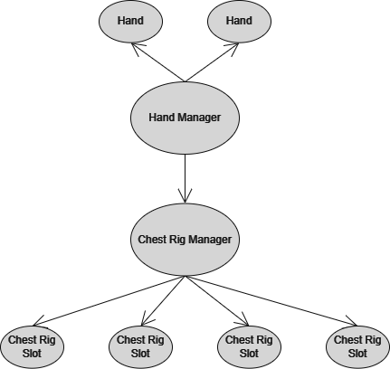
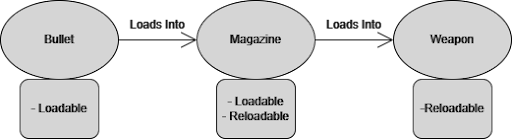
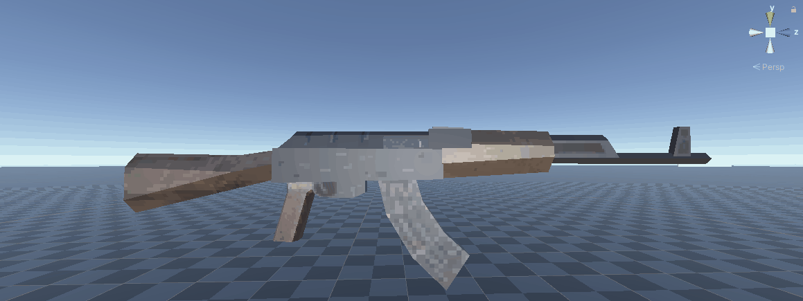
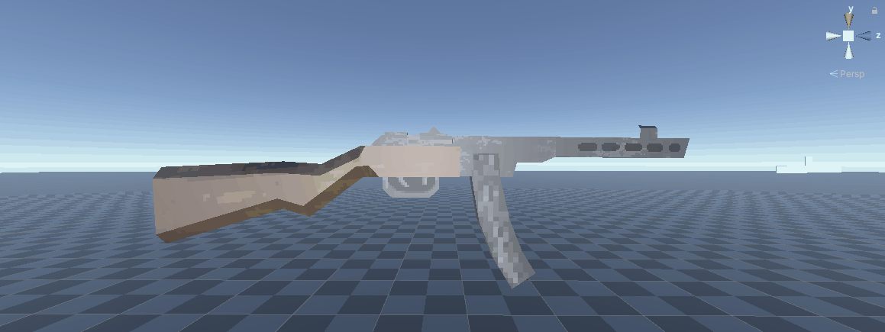
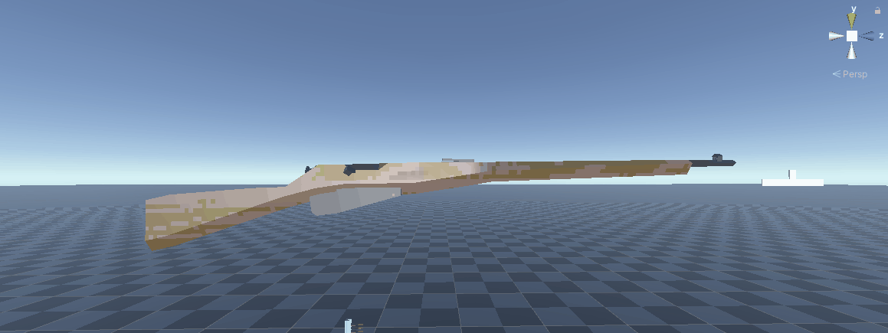
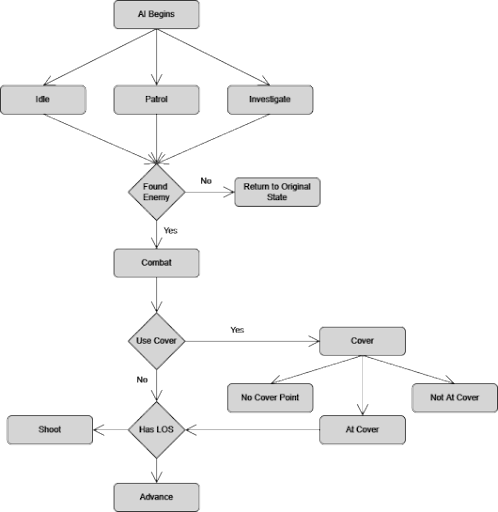

# Wroughtten
### Introduction
This is a repository for a game that I created for my final year project. It's a first person shooter with an emphasis on the iteractions that the player has with the weapons and items. It also features a custom AI which utilises coverpoints and different weapon types.

This game was created as an attempt to transalte the interactions players have with weapons in virtual reality to a standard 'flat' game. This was done through the use of procedural animations that make use of coroutines, where the objects move towards desired points rather than following an animation tree.

The main interactions the player has is interacting with their inventory and weapons. This can be done in multiple different ways such as, filling magazines with ammunition, loading weapons with magazines and manipulating the weapons' bolts.

The game also features a login and highscore table, this is done through the use of web requests, PHP files and an SQL database. Passwords and stores as a SHA256 on the database, the login and highscores may or may not work depending on if the server is up (I used a free webhosting server which often sometimes stopped working randomly). I still woudln't recommend putting any meaningful information into it, it is merely a demo.

More detailed information can be found in the Design Document and the Final Report.

### Background
The reason behind creating this project was to recreate the interaction players have in virtual reality, and try make it more accessable to those who don't have the equipment to do so. The main games that I used as references when creating the games mechanics are [Hot Dogs, Horseshoes & Hand Grenades](https://store.steampowered.com/app/450540/Hot_Dogs_Horseshoes__Hand_Grenades/), [Pavlov VR](https://store.steampowered.com/app/555160/Pavlov_VR/) and [Receiver 2](https://store.steampowered.com/app/1129310/Receiver_2/). 

The game itself is created using Unity (ver 2021.1.24f1) and was written in C#. Throughout the project I tried to create everything myself, so all the assets were created by me using Autodesk Maya (student version) and GIMP. The aesthetics of the game are an attempt to recreate older games such as [Quake](https://store.steampowered.com/app/2310/Quake/), which served as ispiriation for the models alongside other games such as [DUSK](https://store.steampowered.com/app/519860/DUSK/), this was because lower poly models are much easier and faster to create, rather than high poly meshes.
### Interactions
##### Hands & Storage

The hand system in the game is an attempt to mimic actual hands, where the player can use Q and E to pick up items in thier left and right hand. The player can use Z and X to drop items too.

Weapons should be held in the left have (picked up using Q), as this is the hand that allows control on the weapon. Ammo can then be picked up and loaded using the right hand. This was done as most games have players pick up items using E or F.

The storage system make use of numbers 1-6. The player has a number of storage spots on their player, they can use 1-6 to retrieve or store items from those slots. When storing/retrieving it gives the right hand priority as weapons are held in the left. 
##### Loading

###### Loadables
These are the objects that get loaded into a reloadable. An example is bullets into a 	magazine. There are 3 types of loadables, Bullets, Clips and Magazines. These are used 	to determine the position, they move to when being loaded.
###### Reloadables
Reloadables are objects that can be reloaded. Reloadable objects take parameters for what type of loadable it will load, and the position that loadable to move to when being loaded. Loadables can also be reloadable, an example being a clip. The player can load bullets into the clip, which can then be loaded into a weapon.

Animations are created by moving the loadable towards the reloadable.

### Weapons
The game features 3 weapon systems, each one with its own unique interactions. The weapons system are closed bolt, open bolt and bolt action.

Each weapon has its own configuration of parts that make them unique, this could be using internal/external magazines, the weapon being semi-automatic or automatic and the bolting systems, close bolt, open bolt, or bolt action.

A weapon in the game is a combination of fire-modes, magazines, and the bolt system the weapon inherits. Weapons feature a fire selector, bolt, and magazine. They can also have additional features, such as a mounting point for stripper clips and the option for internal or external magazines.

### Bolts

##### Closed Bolt

One type of weapon system in the game is closed bolt weapons. These bolts characteristics are that when there is a round ready to fire, all works parts of the weapon are forward, pulling the trigger causes the round to go off, by a firing pin or striker hitting the round. 

##### Open Bolt

Another type is open bolt. The main characteristics of this type are that the components are instead held to the rear of the receiver when ready to fire. 
When the trigger is pulled the bolt will then travel forward and collect a round from the magazine, it is then chambered and fired. This recoils the bolt back where it is caught by the sear stopping it from sliding forward again.

##### Bolt Action

The final bolt type implemented is bolt action. This type of system is much more of a primitive system than the others. Starting open the bolt is pushed forward, collecting a round from the magazine, once the bolt is completely forward, it is then rotated, locking the bolt closed. Then the trigger is pulled firing a round, the bolt must then be rotated and pulled back, once it is back far enough the casing is ejected and it is ready to take a new round.

### AI

The AI in wrougtten is designed to be very configurable, allowing designers to change many options to make enemies act differently from one another and give them different weapons and loot.
The AI are split amongst 4 different states, which control what they do, and they also have substates for other actions within those states. The AI have behavior that they will carry out regardless of state, such as searching for enemies, and keeping track of their target if they have one.
AI can be set to default to one of the states and any specific substate. If their default state is patrolling, they will patrol an area, and if their substate is seeking cover, then when in combat they will firstly seek cover.

Again, for more detailed descriptions please look at the Game Design Document and the Final Report.
